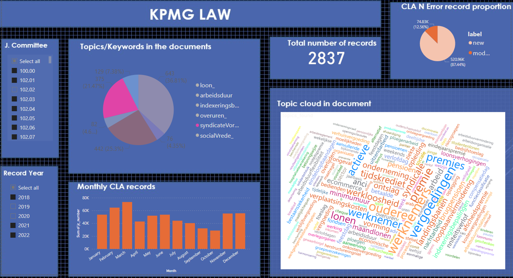

# KPMG Document processing

[KPMG](https://home.kpmg/be/en/home.html) Document processing is project aim to Extracting Info from CAO Documents using the available meta-data and Artificial Intelligence (NLP) the relevant information will be extracted from the documents. The client needs this information in a
structured way, so integrations with existing platforms and/or new reporting.

- ***Dataset:*** 
    - CLA metadata (2018-2022).csv
    - Joint_Committees.xlsx
    - 5690 CLA_file.pdf

- ***Steps we follow:*** 
* Convert CLA_file.pdf to text with [PDF MINER.SIX’S](https://pdfminersix.readthedocs.io/en/latest/),

* In CLA_file we have two language (Dutch and France) so spliting language with [langdetect 1.0.9](https://github.com/Mimino666/langdetect).
    
	
* Mining text to find the key word search with [yake 0.4.8](https://pypi.org/project/yake/)  and summarization  with [Jax](https://jax.readthedocs.io/en/latest/) , [PyTorch](https://pytorch.org/docs/stable/index.html) and [TensorFlow](https://www.tensorflow.org/api_docs).


	
* For Analysis and Dashboard we use [Microsoft Power BI](https://powerbi.microsoft.com/en-us/downloads/) 

* This Is our Interactive dashboard to view performance against Business-User-Based Metrics




  
 

## Prerequisites
 
Requirements for the software and other tools in order to run the whole programe:

* [Python 3.10](https://www.python.org/downloads/release/python-3100/)
 * [Natural Language Toolkit](https://www.nltk.org/)
* [spaCy](https://spacy.io/usage/spacy-101)
* [SQLite](https://www.sqlite.org/docs.html)
* [Pandas](https://pandas.pydata.org/docs/)
* [Microsoft Power BI](https://powerbi.microsoft.com/en-us/downloads/) 


## Usage
Crate docker image from docker file and run the docker image to use the application. 

Building docker image

    docker build -t realestatepriceprediction
	
Running docker image

    docker run -d -p 80:80 realestatepriceprediction
	
It can also be used by running app.py in the deployment folder.
	
	```
	> python3 /deployment/app.py 

	OR

	> python /deployment/app.py 

	OR

	> py /deployment/app.py 		
	```
      

		
		
## License

Free license

## Project Team:
* [Abdulhamid Albaz](https://github.com/Abdulhamid900)
* [Beatrice Van de Vijvere](https://github.com/Beavdv)
* [Genet Abay Shiferaw](https://github.com/Genet-Abay)

